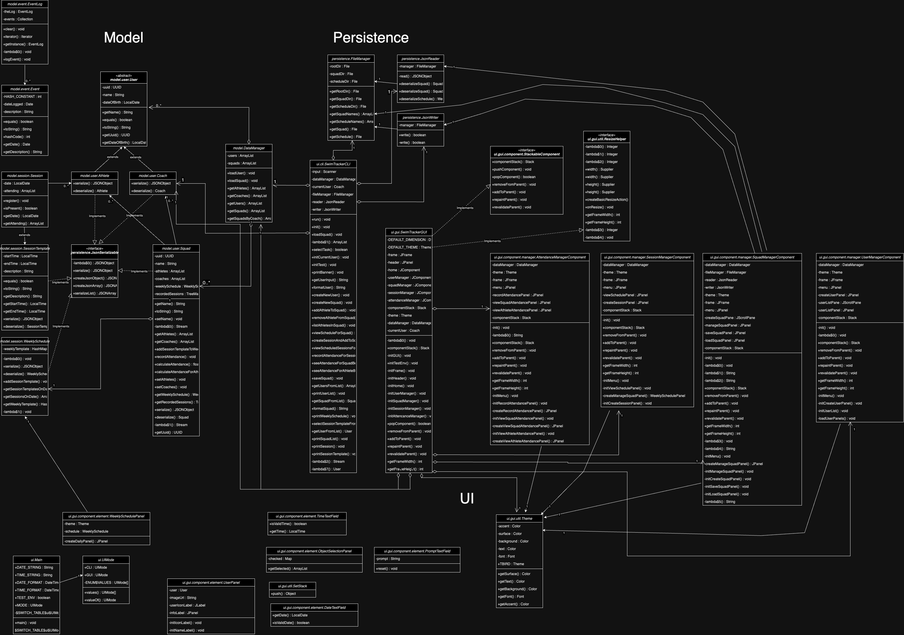

# CPSC 210 Project - Swim Session Attendance Tracker

## Overview

This projects aims to create a piece of software designed to streamline tracking of swim session attendance for swim coaches. The software will allow coaches to **create weekly session schedules** for their squads and **log attendance** for each individual athlete. The software will be able to provide coaches with statistics such as individual and squad **attendance percentages** over a defined period. As a member of the varsity swim team with over 10 years of experience swimming competitively, I understand the importance of consistency and accountability in training. This project not only reflects my passion for swimming but also aims to be a useful tool for both athletes and coaches.

## User Stories

- As a user I want to be able to create a user and specify if they are a coach or athlete
- As a user I want to be able to create a squad 
- As a user I want to be able to add athletes to a squad **(add Xs to Y)**
- As a user I want to be able to remove athletes from a squad
- As a user I want to be able to list all athletes in a squad **(list all Xs in Y)**
- As a user I want to be able to view a weekly schedule for one of my squads 
- As a user I want to be able to create a session and add it to a weekly schedule for one of my squad
- As a user I want to be able to view my scheduled sessions for a particular date
- As a user I want to be able to record attendance for a particular session
- As a user I want to be able to be able to see attendance % for my squad between 2 particular dates
- As a user I want to be able to be able to see attendance % for a particular athlete between 2 particular dates

- As a user I want to be able to save my squad to a file
- As a user I want to be able to load my squad from a file

## Phase 4: Task 2 - Logging

The application logs the following events:

- Loading users in datamanager
- Loading squads in datamanager
- Registering athletes to session
- Adding session template to weekly schedule
- Recording attendance for a session
- Reading json file
- Writing to json file

## Structure

### Class Diagram


### Class Diagram (Packages Coloured)
.png>)

## Phase 4: Task 3 - Possible Refactoring

- My ui classes contained a lot of repeat code for making buttons etc, creating methods to reduce this could make for shorter more readable code. 

- Many ui classes rely on the DataManager class and other classes in the model package. Introducing a class inbetween these 2 packages could make the program more modular and then if any changes are made to the DataManager then it would be easier to change.

- Alternatively, since many ui classes and others have a DataManager field, I could get rid of these and turn DataManager into a singleton pattern. This would reduce the connections between the packages

## UML Class Diagram Generator

To help make the UML Class Diagram I made a class that can create the XML code to paste into [drawio](https://www.drawio.com/).

### Example Usage

```java
List<Class<?>> classes = Arrays.asList(AClass.class, AnotherClass.class, ...); // classes to include
boolean simple = false; // should include methods and fields

ClassDiagram table = new ClassDiagram(classes, simple); // create the diagram object

String xml = table.toString(); // the xml for class diagram
``` 